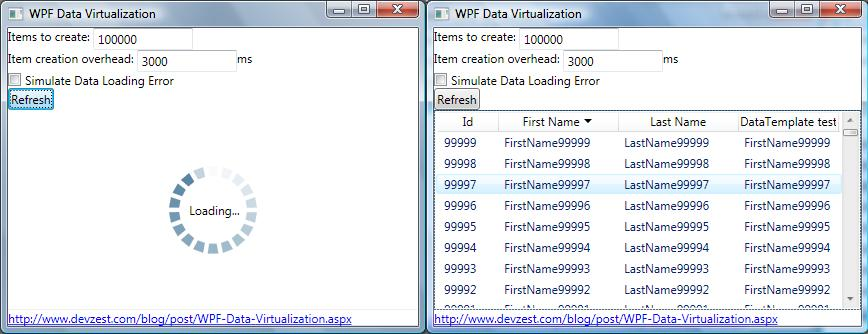
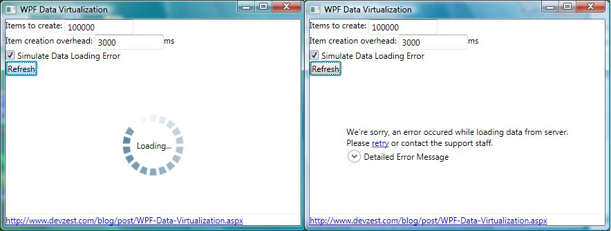

# DevZest.DataVirtualization

[The DevZest Blog | WPF Data Virtualization](http://web.archive.org/web/20180814144210/http://www.devzest.com:80/blog/post/WPF-Data-Virtualization.aspx)



## Introduction

In a typical WPF + WCF LOB application, displaying and interacting a large data set is not a trivial task. While several posts on internet forums discuss data virtualization, none of them has all the following:

- Selection, sorting and filtering works well as if all data are stored locally;
- Data loading as needed, in a separate thread, without blocking the UI;
- Visual feedback when data is loading; if failed, user can retry the last failed attempt.

The attached source code contains a highly reusable component which resolves all the above issues, together with a demo WPF application.

## Built-in WPF UI Virtualization

First of all, your UI should only demand data items actually visible on screen. As of .NET 3.5 SP1, this is what you can do for `ItemsControl` and derivatives:

- Make the number of UI elements to be created proportional to what is visible on screen using`VirtualizingStackPanel.IsVirtualizing="True"`.
- Have the framework recycle item containers instead of (re)creating them each time, by setting`VirtualizingStackPanel.VirtualizationMode="Recycling"`.
- Defer scrolling while the scrollbar is in action by using `ScrollViewer.IsDeferredScrollingEnabled="True"`. This improves *perceived* performance, by waiting until the user releases the scrollbar thumb to update the content.

For more information, please read [this post](http://web.archive.org/web/20180814144210/http://social.msdn.microsoft.com/Forums/en-US/wpf/thread/98090161-0abf-4799-bbcb-852dcc0f0608).

## `VirtualList<T>` & `VirtualListItem<T>`

`VirtualList<T>` is the `IList<T>` implementation that performs the data virtualization. To create a new instance of `VirtualList<T>`, you need an `IVirtualListLoader<T>` instance, to load small chunks (or pages) and return the total number of the entire collection:

```csharp
public interface IVirtualListLoader<T>
{
    bool CanSort { get; }
    IList<T> LoadRange(int startIndex, int count, SortDescriptionCollection sortDescriptions, out int overallCount);
}
...
public partial class VirtualList<T> : IList<VirtualListItem<T>>, ...
{
    ...
    public VirtualList(IVirtualListLoader<T> loader)
    ...
}
```

`VirtualList<T>` contains an array of `VirtualListItem<T>`, which is used as proxy of the real data:

```csharp
public sealed class VirtualListItem<T> : VirtualListItemBase, INotifyPropertyChanged
{
    public VirtualList<T> List
    {
        get;
    }

    public int Index
    {
        get;
    }

    public bool IsLoaded
    {
        get;
    }

    public T Data
    {
        get;
    }

    public void Load();

    public void LoadAsync();

}
```

You can data binding `VirtualListItem<T>` just like any other object. The following XAML code binds ListView column to `VirtualList<Person>` object (please note the binding path `Data.PropertyName` is used):

```xaml
<GridViewColumn Width="60" DisplayMemberBinding="{Binding **Data.Id**}" Header="Id" .. />
<GridViewColumn Width="120" DisplayMemberBinding="{Binding **Data.FirstName**}" Header="First Name" .. />
<GridViewColumn Width="120" DisplayMemberBinding="{Binding **Data.LastName**}" Header="Last Name" .. />
```

Data is loaded explicitly: unless `Load` or `LoadAsync` is called, the `IsLoaded` will always be `false` and `Data` will always be `default(T)`. Once data loaded, it will remain unchanged until the whole list is refreshed. Calling `Load` or `LoadAsync` will load one page of data items if not already loaded, and the first page will be loaded asynchronously when the collection is created or refreshed.

By setting `ContentControl`'s `VirtualListItemBase.AutoLoad` attached property to `true`, `LoadAsync` will be called once `VirtualListItem<T>` object is set as `ContentControl.Content`. The following XAML code will load data automatically when `VirtualListItem<T>` object is attached to `ListViewItem`:

```xaml
<!-- Setting VirtualListItemBase.AutoLoad to true will load the item when it's set to ListViewItem.Content property -->
<Style TargetType="ListViewItem">
    <Setter Property="dz:VirtualListItemBase.AutoLoad" Value="true" />
</Style>
```

**Summary:**`VirtualListItem<T> object acts as proxy of the real data. Selection works well as if all data stored locally, and data is loaded as needed, in a separate thread, without blocking the UI.

## Data Loading Visual Feedback

The UI should display a "Loading..." animation when data is loading, to tell end user what is going on. When something is wrong, an error message should be displayed and allows end user to retry the last failed attempt. Well a picture is worth a thousand words:



The `VirtualListLoadingIndicator` control is provided for this purpose. It has a `IsAttached` attached property, when set to `true`, display itself at the adorner layer of attached `ItemsControl` with its `ItemsSource` is set to a `VirtualList`. The following XAML code enables the data loading visual feedback for the ListView:

```xaml
<ListView
    ...
    dz:VirtualListLoadingIndicator.IsAttached="True">
    ...
</ListView>
```

You can customize `VirtualListLoadingIndicator` control by overriding the default control template just like any other WPF control; and since the `VirtualListLoadingIndicator` control is loosely coupled with other classes, you can replace it completely with your own class without changing any other existing class.

## Sorting and Filtering

WPF never binds directly to a collection, but to a view. The view can be obtained by calling:

```csharp
CollectionViewSource.GetDefaultView(listView.ItemsSource);
```

The return value is a type implementing `ICollectionView`. If the `ItemsSource` is bound to a `List<T>`, which implements `System.Collections.IList`, `GetDefaultView` will choose to return `ListCollectionView` if `ItemsSource` does not implement `ICollectionViewFactory`. When sorting and filtering against `ListCollectionView` (the default implementation), it will demand all data items from the original `IList` first, and do the sorting and filtering locally. Apparently this will destroy all our effect of data virtualization -- we need to implement our own `ICollectionView`, delegating the sorting and filtering to the underlying `IVirtualListLoader<T>`.

Due to the nature that data is virtualized, providing multiple view for the same `VirtualList<T>` does not make too much sense -- imagine sorting on one view needs to actually sorting on underlying `IVirtualListLoader<T>`, so all other views get updated. We choose to implement `ICollectionView` and `ICollectionViewFactory` for `VirtualList<T>`, to return itself as the view (thanks to the code of Vincent Van Den Berghe which can be downloaded at [Bea's blog post](http://web.archive.org/web/20180814144210/http://bea.stollnitz.com/blog/?p=344)):

```csharp
partial class VirtualList<T> : ICollectionView, ICollectionViewFactory
{
    ...
    #region ICollectionViewFactory Members

    ICollectionView ICollectionViewFactory.CreateView()
    {
        return this;
    }

    #endregion

}
```

Please note current `ICollectionView` implementation does not support filtering, because `ICollectionView.Filter` is designed for client side filtering (it accepts a `Predicate<object>` delegate and as far as I can tell, it's hard to be serialized and deserialized which is required in a scenario such as WCF). To filter, you can implement the logic on your `VirtualListLoader<T>` implementation, and refresh the collection.

## Sorting GridView Column

Strictly speaking, this is independent of data virtualization -- it's a bonus from developing the demo application -- we want the GridView automatically sorted when the column is clicked, and a sort glyph in the column header to show which column is sorted. Instead of wiring the `Click` event of the `GridViewColumnHeader` class, we provide a generic solution through attached property so that no code behind is required (thanks for [Thomas Levesque's blog post](http://web.archive.org/web/20180814144210/http://tomlev2.wordpress.com/2009/08/04/wpf-automatically-sort-a-gridview-continued/)):

The `GridViewSort` class has `AutoSort` and `PropertyName` attached properties which you can use to setup on `ListView` and `GridViewColumn`:

```xaml
<ListView ... dz:GridViewSort.AutoSort="True">
    <ListView.View>
        <GridView ...">
            <GridViewColumn ... dz:GridViewSort.PropertyName="Id" />
            <GridViewColumn ... dz:GridViewSort.PropertyName="FirstName" />
            <GridViewColumn ... dz:GridViewSort.PropertyName="LastName" />
            ...
        </GridView>
    </ListView.View>
</ListView>
```

`GridViewSort` class handles column header clicking and sorts the `ListView`, then sets back the value for `GridViewSort.SortOrder` attached property of clicked `GridViewColumnHeader`, which you can use to show a sort glyph, or any other visual feedback:

```xaml
<!-- ColumnHeader template to show up and down arrow when sorted -->
<DataTemplate x:Key="ListViewColumnHeaderTemplate">
    <Grid>
        <Grid.ColumnDefinitions>
            <ColumnDefinition Width="*" />
            <ColumnDefinition Width="Auto" />
        </Grid.ColumnDefinitions>
        <ContentPresenter ContentTemplate="{x:Null}" />
        <Path x:Name="Path" Grid.Column="1" Fill="Black" Margin="4,0,2,0" VerticalAlignment="Center" />
    </Grid>
    <DataTemplate.Triggers>
        <DataTrigger Binding="{Binding RelativeSource={RelativeSource FindAncestor, AncestorType={x:Type GridViewColumnHeader}, AncestorLevel=1}, Path=(dz:GridViewSort.SortOrder)}" Value="None">
            <Setter TargetName="Path" Property="Visibility" Value="Collapsed" />
        </DataTrigger>
        <DataTrigger Binding="{Binding RelativeSource={RelativeSource FindAncestor, AncestorType={x:Type GridViewColumnHeader}, AncestorLevel=1}, Path=(dz:GridViewSort.SortOrder)}" Value="Ascending">
            <Setter TargetName="Path" Property="Data" </span>Value="M 0 4 L 4 0 L 8 4 Z" />
        </DataTrigger>
        <DataTrigger Binding="{Binding RelativeSource={RelativeSource FindAncestor, AncestorType={x:Type GridViewColumnHeader}, AncestorLevel=1}, Path=(dz:GridViewSort.SortOrder)}" Value="Descending">
            <Setter TargetName="Path" Property="Data" Value="M 0 0 L 4 4 L 8 0 Z" />
        </DataTrigger>
    </DataTemplate.Triggers>
</DataTemplate>

...
<ListView ...>
    <ListView.View>
        <GridView ColumnHeaderTemplate="{StaticResource ListViewColumnHeaderTemplate}">
        ...
        </GridView>
    </ListView.View>
</ListView>
```

## Putting it Altogether

A simple demo project is created to demonstrate this solution. The full source code is available in the downloadable attachment.

Firstly, an implementation of `IVirtualListLoader<Person>` was created, which provides dummy `Person` data with a thread sleep used to simulate delays such as calling a WCF service via internet, and throws exception when `SimulateDataLoadingError` property is set to `true`:

```csharp
#region IVirtualListLoader<Person> Members

public bool CanSort
{
    get { return true; }
}

public IList<Person> LoadRange(int startIndex, int count, SortDescriptionCollection sortDescriptions, out int overallCount)
{
    int creationOverhead = Invoke(() => { return CreationOverhead; });
    Thread.Sleep(creationOverhead);

    bool simulateError = Invoke(() => { return SimulateDataLoadingError; });
    if (simulateError)
        throw new ApplicationException("An simulated data loading error occured. Clear the \"Simulate Data Loading Error\" checkbox and retry.");

    overallCount = Invoke(() => { return ItemCount; });

    // because the all fields are sorted ascending, the PropertyName is ignored in this sample
    // only Direction is considered.
    SortDescription sortDescription = sortDescriptions == null || sortDescriptions.Count == 0 ? new SortDescription() : sortDescriptions[0];
    ListSortDirection direction = string.IsNullOrEmpty(sortDescription.PropertyName) ? ListSortDirection.Ascending : sortDescription.Direction;

    Person[] persons = new Person[count];
    for (int i = 0; i < count; i++)
    {
        int index;
        if (direction == ListSortDirection.Ascending)
            index = startIndex + i;
        else
            index = overallCount - 1 - startIndex - i;

        persons[i] = new Person(index);
    }

    return persons;
}

#endregion
```

A simple WPF window with a `ListView` was created to allow the user to experiment the features:

```xaml
<Window x:Class="DevZest.DataVirtualizationDemo.Window1"
    xmlns="http://schemas.microsoft.com/winfx/2006/xaml/presentation"
    xmlns:x="http://schemas.microsoft.com/winfx/2006/xaml"
    xmlns:local="clr-namespace:DevZest.DataVirtualizationDemo"
    xmlns:dz="clr-namespace:DevZest.Windows.DataVirtualization;assembly=DevZest.DataVirtualization"
    Title="DevZest Data Virtualization for WPF Demo" SizeToContent="WidthAndHeight"
    DataContext="{Binding RelativeSource={RelativeSource Self}}">
    <Window.Resources>
        <DataTemplate DataType="{x:Type local:Person}">
            <TextBlock Text="{Binding FirstName}" />
        </DataTemplate>

        <!-- Setting VirtualListItemBase.AutoLoad to true will load the item when it's set to ListViewItem.Content property -->
        <Style TargetType="ListViewItem">
            <Setter Property="dz:VirtualListItemBase.AutoLoad" Value="true" />
        </Style>

        <!-- ColumnHeader template to show up and down arrow when sorted -->
        <DataTemplate x:Key="ListViewColumnHeaderTemplate">
            <Grid>
                <Grid.ColumnDefinitions>
                    <ColumnDefinition Width="*" />
                    <ColumnDefinition Width="Auto" />
                </Grid.ColumnDefinitions>
                <ContentPresenter ContentTemplate="{x:Null}" />
                <Path x:Name="Path" Grid.Column="1" Fill="Black" Margin="4,0,2,0" VerticalAlignment="Center" />
            </Grid>
            <DataTemplate.Triggers>
                <DataTrigger Binding="{Binding RelativeSource={RelativeSource FindAncestor, AncestorType={x:Type GridViewColumnHeader}, AncestorLevel=1}, Path=(dz:GridViewSort.SortOrder)}" Value="None">
                    <Setter TargetName="Path" Property="Visibility" Value="Collapsed" />
                </DataTrigger>
                <DataTrigger Binding="{Binding RelativeSource={RelativeSource FindAncestor, AncestorType={x:Type GridViewColumnHeader}, AncestorLevel=1}, Path=(dz:GridViewSort.SortOrder)}" Value="Ascending">
                    <Setter TargetName="Path" Property="Data" Value="M 0 4 L 4 0 L 8 4 Z" />
                </DataTrigger>
                <DataTrigger Binding="{Binding RelativeSource={RelativeSource FindAncestor, AncestorType={x:Type GridViewColumnHeader}, AncestorLevel=1}, Path=(dz:GridViewSort.SortOrder)}" Value="Descending">
                    <Setter TargetName="Path" Property="Data" Value="M 0 0 L 4 4 L 8 0 Z" />
                </DataTrigger>
            </DataTemplate.Triggers>
        </DataTemplate>

    </Window.Resources>
    <StackPanel>
        <StackPanel >
            <StackPanel Orientation="Horizontal">
                <TextBlock Text="Items to create: " />
                <TextBox Width="100" Text="{Binding ItemCount}" />
            </StackPanel>
            <StackPanel Orientation="Horizontal">
                <TextBlock Text="Item creation overhead: " />
                <TextBox Width="100" Text="{Binding CreationOverhead}" />
                <TextBlock Text="ms" />
            </StackPanel>
            <CheckBox IsChecked="{Binding SimulateDataLoadingError}">Simulate Data Loading Error</CheckBox>
            <StackPanel Orientation="Horizontal">
                <Button Click="Refresh_Click">Refresh</Button>
            </StackPanel>

        </StackPanel>

        <ListView
            x:Name="listView"
            VirtualizingStackPanel.IsVirtualizing="True"
            VirtualizingStackPanel.VirtualizationMode="Recycling"
            ScrollViewer.IsDeferredScrollingEnabled="True"
            dz:GridViewSort.AutoSort="True"
            dz:VirtualListLoadingIndicator.IsAttached="True"
            Height="200">
            <ListView.View>
                <GridView ColumnHeaderTemplate="{StaticResource ListViewColumnHeaderTemplate}">
                    <GridViewColumn Width="60" DisplayMemberBinding="{Binding Data.Id}" Header="Id" dz:GridViewSort.PropertyName="Id" />
                    <GridViewColumn Width="120" DisplayMemberBinding="{Binding Data.FirstName}" Header="First Name" dz:GridViewSort.PropertyName="FirstName" />
                    <GridViewColumn Width="120" DisplayMemberBinding="{Binding Data.LastName}" Header="Last Name" dz:GridViewSort.PropertyName="LastName" />
                    <GridViewColumn Width="100" Header="DataTemplate test">
                        <GridViewColumn.CellTemplate>
                            <DataTemplate>
                                <ContentControl Content="{Binding Data}" />
                            </DataTemplate>
                        </GridViewColumn.CellTemplate>
                    </GridViewColumn>
                </GridView>
            </ListView.View>
        </ListView>
    </StackPanel>
</Window>

```

That's all! Hope you will enjoy using this component.

## License

This component and the demo application, is under MIT license:

Copyright (c) 2010 DevZest ([http://www.devzest.com](http://web.archive.org/web/20180814144210/http://www.devzest.com/))

Permission is hereby granted, free of charge, to any person obtaining a copy of this software and associated documentation files (the "Software"), to deal in the Software without restriction, including without limitation the rights to use, copy, modify, merge, publish, distribute, sublicense, and/or sell copies of the Software, and to permit persons to whom the Software is furnished to do so, subject to the following conditions:

The above copyright notice and this permission notice shall be included in all copies or substantial portions of the Software.

THE SOFTWARE IS PROVIDED "AS IS", WITHOUT WARRANTY OF ANY KIND, EXPRESS OR IMPLIED, INCLUDING BUT NOT LIMITED TO THE WARRANTIES OF MERCHANTABILITY, FITNESS FOR A PARTICULAR PURPOSE AND NONINFRINGEMENT. IN NO EVENT SHALL THE AUTHORS OR COPYRIGHT HOLDERS BE LIABLE FOR ANY CLAIM, DAMAGES OR OTHER LIABILITY, WHETHER IN AN ACTION OF CONTRACT, TORT OR OTHERWISE, ARISING FROM, OUT OF OR IN CONNECTION WITH THE SOFTWARE OR THE USE OR OTHER DEALINGS IN THE SOFTWARE.